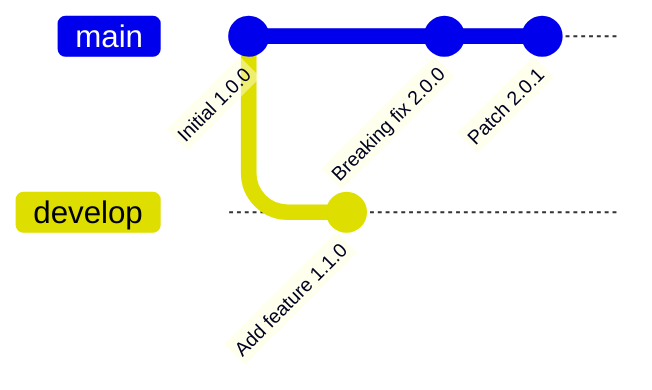
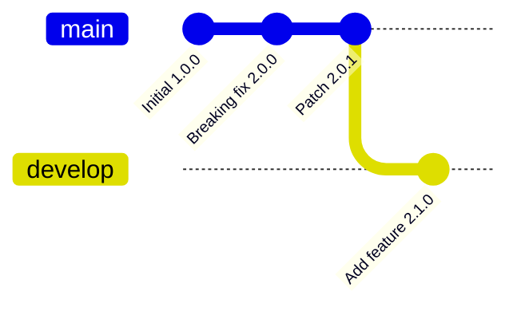

# Semver-Rebase-Driver

> [!IMPORTANT]
> This is a work in progress 'one-evening' project, don't expect too much out of it.

A CLI tool to use as git merge driver specialized for automatic rebasing of semver based 'keep a changelog' files from 
feature branches onto upstream branches. Built with crystal-lang.

Rebasing `package.json` based projects that follow semantic versioning or changelogs can be tedious as these files don’t merge cleanly with Git’s default merge drivers. In some projects/workflows they are almost always conflict during rebase.  

The goal is to go from


to  


without manually fixing conflicts on versions or added changelog entries.  

## Installation

Install dependencies and build: `shards build`.  
Tests: `crystal spec`

## Usage

```
echo "## [1.0.0]" > test-base.md

echo "## [2.0.0]" > test-upstream.md
echo "## [1.0.0]" >> test-upstream.md

echo "## [1.1.0]" > test-local.md
echo "## [1.0.0]" >> test-local.md

./bin/semver-rebase-driver changelog -b test-base.md -u test-upstream.md -l test-local.md -o test-output.md

cat test-output.md
```

TODO: show how to set up the git driver, detailed usage

## Contributing

1. Fork it (<https://github.com/globoplox/semver-rebase-driver/fork>)
2. Create your feature branch (`git checkout -b my-new-feature`)
3. Commit your changes (`git commit -am 'Add some feature'`)
4. Push to the branch (`git push origin my-new-feature`)
5. Create a new Pull Request

## Contributors

- [globoplox](https://github.com/globoplox) - creator and maintainer
